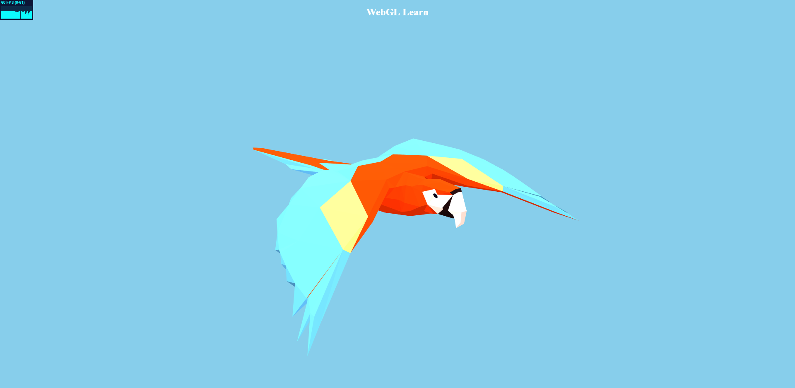

# WebGL-learn

Side-project for learning THREE.js and GLSL facilities.

### Current scene screen:

## ToDO:

- [x] Initialize scene
- [x] External model loading
- [ ] Load wine bottle
- [ ] Create full scene
- [ ] Github page init
- [ ] View control remaster
- [ ] Initialize shader-material
- [ ] Move async operations to rxjs

Processes:

  - [ ] CMYK
  - [ ] Substrate
  - [ ] Opaque White
  - [ ] SpotUV
  - [ ] FullUV
  - [ ] Texture
  - [ ] Foil
  - [ ] Metallic
  - [ ] Glitter

## Change log

### 02/22/2019

- Use external image as texture
- Load external .gltf model
- Add OrbitControl
- App refactoring

### 02/15/2019

- Project initialization
